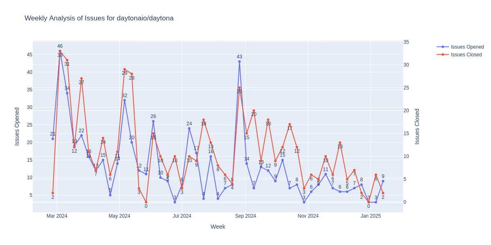

# Daytona Issues Analysis

This repository contains a Python script that analyzes GitHub issues for the [Daytona](https://github.com/daytonaio/daytona) project. It generates weekly statistics and visualizations of opened and closed issues.

## Features

- Fetches issue data from GitHub API
- Analyzes weekly trends of opened and closed issues
- Generates visualization plot
- Saves detailed results in text format

## Latest Analysis Results



## Requirements

- Python 3.x
- Required packages:
  - requests
  - pandas
  - plotly
  - kaleido

## Setup

1. Clone the repository:
```bash
git clone https://github.com/yourusername/daytona-issues-analysis.git
```

2. Install dependencies:
```bash
pip install -r requirements.txt
```

3. Set up GitHub token:
```bash
export GITHUB_TOKEN='your_github_token'
```

## Usage

Run the analysis script:
```bash
python daytona_issues.py
```

The script will:
- Generate a weekly issues analysis plot (`artifact/weekly_issues_plot.png`)
- Save detailed results in a dated text file (`artifact/YYYYMMDD_weekly_issues_results.txt`)

## Output

- Visual plot: `artifact/weekly_issues_plot.png`
- Detailed results: `artifact/YYYYMMDD_weekly_issues_results.txt`
