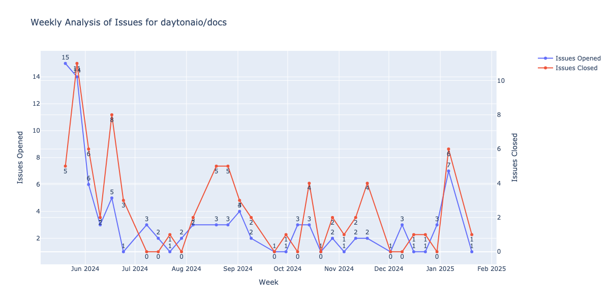

# Daytona Docs Issues Analysis

Automated weekly analysis of GitHub issues for the [Daytona Documentation](https://github.com/daytonaio/docs). This repository runs analysis every Monday via GitHub Actions to track and visualize issue trends.

## Latest Analysis Results



## How it Works

The analysis script:
- Runs automatically every Monday via GitHub Actions
- Fetches issue data from GitHub API
- Generates weekly statistics of opened/closed issues
- Updates the visualization
- Saves detailed results in dated text files

## Automation Details

- Schedule: Weekly (Every Monday)
- Workflow file: `.github/workflows/weekly-analysis.yml`
- Output:
  - Updated plot: `artifact/weekly_issues_plot.png`
  - Weekly results: `artifact/YYYYMMDD_weekly_issues_results.txt`

## Development

Requirements:
```txt
requests
pandas
plotly
kaleido
```

To run locally, set up your GitHub token:
```bash
export GITHUB_TOKEN='your_github_token'
```

Then run:
```bash
python daytona_issues.py
```